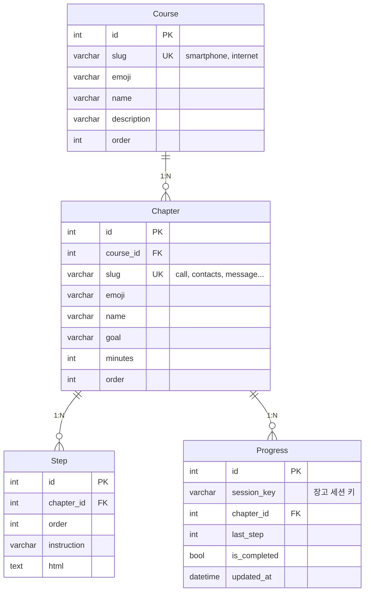

# ERD 설계 — 스마트 한걸음

> 콘텐츠는 **코스 → 챕터 → 스텝** 3단 구조, 진도는 **로그인 없이 세션 기반**으로 서버 DB에 저장한다.

---

## 1. 전체 구조



**핵심 설계 포인트: 사용자(User) 테이블이 없다.** 회원가입 장벽을 없애기 위해 로그인을 받지 않고,
Django가 발급하는 **세션 키(`session_key`)를 사용자 식별자로 사용**한다.
`Progress`가 이 세션 키를 들고 있어서, 같은 브라우저로 재접속하면 진도가 그대로 복원된다.

---

## 2. 테이블 상세

### Course — 코스

| 필드 | 타입 | 설명 |
| --- | --- | --- |
| `id` | PK | 자동 증가 |
| `slug` | CharField(50), unique | URL·프론트 식별자 (`smartphone`, `internet`) |
| `emoji` | CharField(8) | 카드 아이콘 (📱, 🌐) |
| `name` | CharField(50) | "스마트폰 기초" |
| `description` | CharField(200) | 카드 설명 문구 |
| `order` | IntegerField | 목록 정렬 순서 |

### Chapter — 챕터

| 필드 | 타입 | 설명 |
| --- | --- | --- |
| `id` | PK | 자동 증가 |
| `course` | FK → Course | `on_delete=CASCADE`, `related_name="chapters"` |
| `slug` | CharField(50), unique | 프론트 식별자 (`call`, `wifi`, `search`) |
| `emoji` | CharField(8) | 📞, 📶 |
| `name` | CharField(50) | "전화", "와이파이 연결" |
| `goal` | CharField(200) | "전화를 걸고 끊는 방법을 배워요." |
| `minutes` | IntegerField | 예상 소요 시간 (분) |
| `order` | IntegerField | 코스 내 정렬 순서 |

> `slug`를 코스 안에서만 유일하게 둘 수도 있지만, 프론트가 `?chapter=call` 처럼
> **챕터 slug 하나만으로 조회**하므로 (`findChapter(chapterId)`) 전역 unique로 잡는다.

### Step — 스텝 (실습 단계)

| 필드 | 타입 | 설명 |
| --- | --- | --- |
| `id` | PK | 자동 증가 |
| `chapter` | FK → Chapter | `on_delete=CASCADE`, `related_name="steps"` |
| `order` | IntegerField | 챕터 내 단계 순서 (0부터) |
| `instruction` | CharField(200) | "초록색 전화 앱을 눌러보세요." |
| `html` | TextField | 폰 화면 마크업. 정답 위치는 `[data-tap="correct"]` |

> `unique_together = ("chapter", "order")`

### Progress — 진도 (세션 기반)

| 필드 | 타입 | 설명 |
| --- | --- | --- |
| `id` | PK | 자동 증가 |
| `session_key` | CharField(40), index | Django 세션 키 = 익명 사용자 식별자 |
| `chapter` | FK → Chapter | `on_delete=CASCADE` |
| `last_step` | IntegerField, default=0 | 마지막으로 보던 스텝 번호 |
| `is_completed` | BooleanField, default=False | 챕터 완주 여부 |
| `updated_at` | DateTimeField, auto_now=True | "이어서 하기" 판단 기준 |

> `unique_together = ("session_key", "chapter")` — 한 사용자는 챕터당 진도 1행

---

## 3. 왜 Progress를 한 테이블로 합쳤나

프론트는 진도를 **두 갈래로 저장**하고 있다 (`assets/js/progress.js`):

```js
{ completed: ["call", "wifi"],          // 완료한 챕터 목록
  last: { chapterId: "message", step: 3 } }   // 마지막 위치 1개
```

이걸 DB에서도 `CompletedChapter` + `LastPosition` 두 테이블로 나눌 수 있지만, **한 테이블로 합쳤다.**

- 완료 목록 = `Progress.objects.filter(session_key=key, is_completed=True)`
- 이어서 하기 = `Progress.objects.filter(session_key=key, is_completed=False).order_by("-updated_at").first()`

테이블이 하나 줄고, 덤으로 **챕터별 이어보기**가 공짜로 생긴다.
(프론트는 마지막 1개만 기억하지만, DB는 모든 챕터의 중단 지점을 갖는다.)

## 4. 왜 접근성 설정은 DB에 없나

`assets/js/settings.js`의 글자 크게(`lt`) · 고대비(`hc`)는 **기기별 화면 취향**이지
학습 데이터가 아니다. localStorage에 두는 게 맞고, 서버에 올리면 API만 늘어난다.

---

## 5. 확장 여지 (해커톤 이후)

현재 구조는 로그인을 붙일 때 **`Progress.session_key`를 `user` FK로 바꾸는 것만으로** 확장된다.
그 시점에 기기 변경 시 이어보기와 보호자 계정 연동(보호자 → 피보호자 진도 조회)이 열린다.

키오스크·정부24·카카오톡 등 신규 콘텐츠는 **모델 변경 없이 Course/Chapter/Step 행만 추가**하면 된다.
